# BOOCO - The Premier Social Networking App for Readers

    

<strong>BOOCO</strong> is the best place for an integrated social media experience for readers. The <strong>BOOCO</strong> platform boasts an extensive book database, creating a large library of content for our users to explore.

With <strong>BOOCO</strong>, readers can <strong>add friends</strong>, <strong>track books</strong>, and <strong>post thoughts to books</strong>. <strong>BOOCO</strong> also tracks a user's progress through a book as they log it as well as tracking the pattern in a user's genre and mood preference and leverages that so that it can suggest similar books.

Join the <strong>BOOCO</strong> community today! Let's keep reading.

    --------------------------------------------------------

[<strong><em>Stack:</em></strong> React.js, Ruby on Rails, PostgreSQL]

[<strong><em>Technologies:</em></strong> Redux, React Router, devise, devise-jwt, ActionCable, Websockets, JWToken Authentication, Tailwind CSS, Render, Netlify, Deployment]

[<strong><em>Integrated APIs:</em></strong> Google Books, OpenLibrary]

## BOOCO Personalized Reader Homepage

    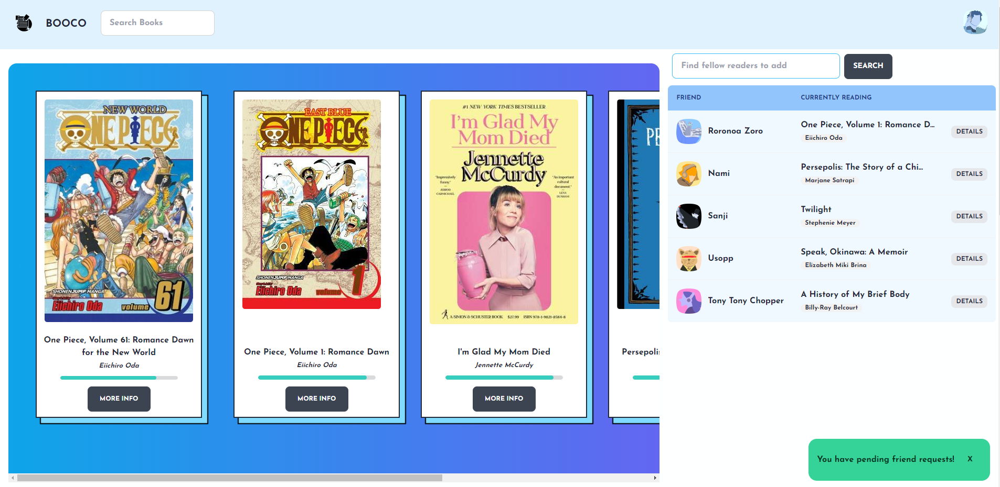

Entering you <strong>BOOCO</strong> homepage means you'll be greeted with all of you tracked books as well as any updates on their statuses and your progress through your "reading" status books.

You will be notified if you have pending friend requests and you'll see your friends displayed to the right of the reading card gallery.

If you need to search for more friends, please use the search bar above the "Friends" table.

    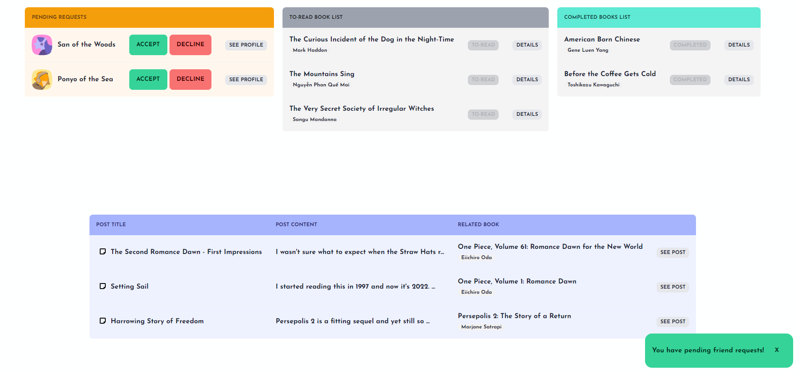

Scroll down and you'll see a list of pending friend requests, books to-read so that you know what to read next, and a list of completed books so you can marvel at your accomplishments.

You can also access a list of your post history to go back over thoughts you've posted for books.

    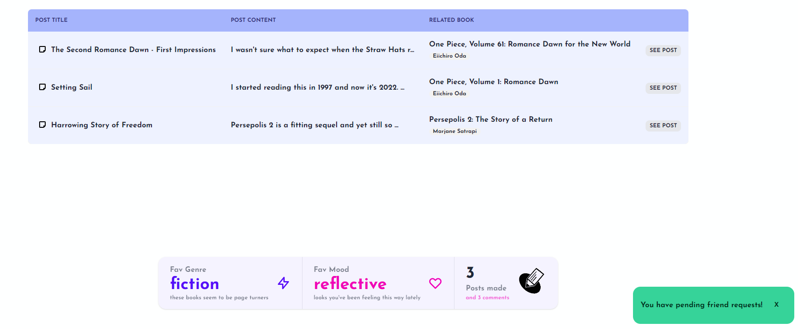

Finally at the bottom of the page, you can see what you're reading history says about you, i.e. what your favorite genre is and what the books you're reading say about the mood your in. You can also see an aggregate total of your posts and comments up until this point.

[<strong><em>Dev Notes:</em></strong> <em>Tracking user's posts and comments are stored in Redux state and is dynamically updated after each successful POST of a post or comment to the backend. Ditto for Friendships which are tracked with a self-referential table which includes a column for friendship status. 

Friendship status between two users dynamically restricts and allows what one user sees about another user when they try to view their page. This relationship between two users is validated in the backend for security purposes and cannot be altered in any way to reveal more information to an unauthorized user on the frontend.</em>]

## BOOCO Book Search and Tracking

    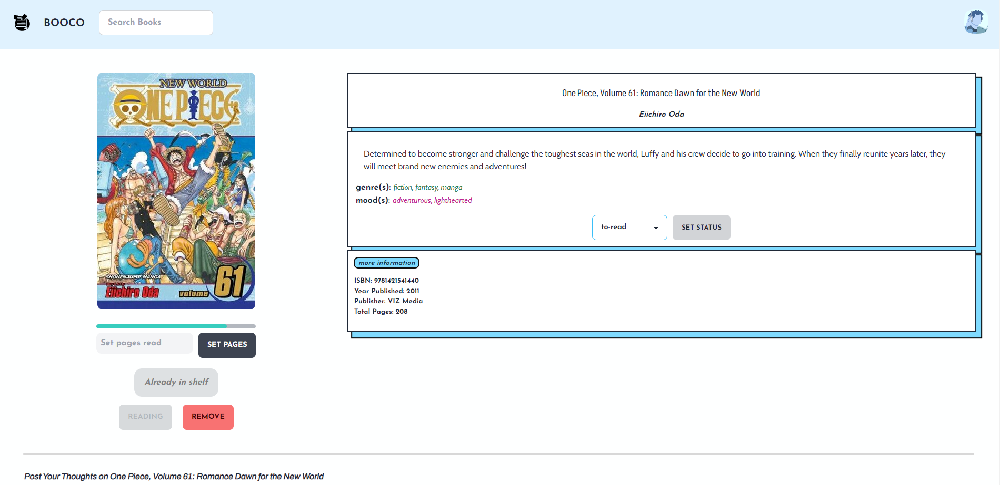

You can view all of book's details by navigating to their book page. In the photo above, the module below the cover picture will only display if a reader: a) has the book tracked and b) specifically has the book labeled as a book they are "reading." 

    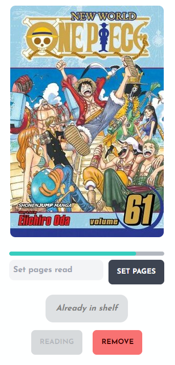

Only then can you, the reader, the set the amount of pages you ahve read of a book, which also contains validations so that you, as a reader, cannot enter an invalid page that exceeds the bounds of the minimum and maximum of a book length.

You can set the status of a book like so:

    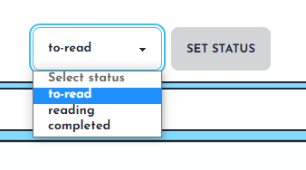

You can remove the book by clicking the Remove button:

    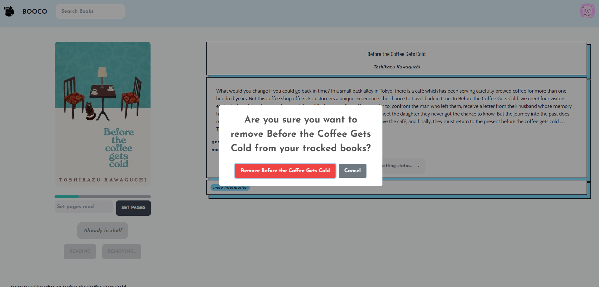

### Search Books

The navbar on the top of the page includes a search bar to search for books that leads to this page:

    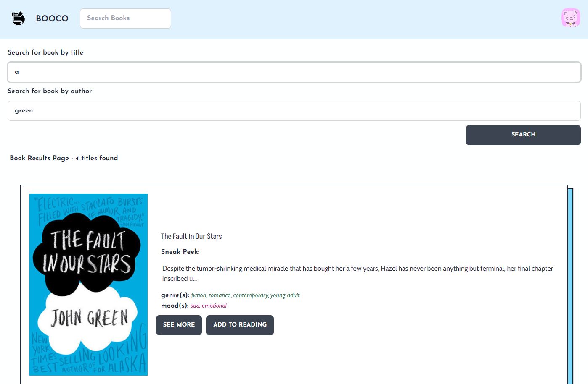

You can search by either title or author or both.

Each book result card will only render an enabled "Add to Reading" button dynamically only <em>if</em> the user is <em>not</em> already tracking it.

Please search and find new books to your heart's content!

[<strong><em>Dev Notes:</em></strong> <em>Books have unique ISBN-13's and this property is used to automate storing books of a certain search query into the correct format that is readable into this app's database.

A prototype of an sorting and assignment algorithm is used to populate genres and moods associated with books and this is taken from the data returned from APIs and generated based on pattern-recognition for certian genres or categories or subjects associated with the returned data.</em>]

## Posting and Commenting

    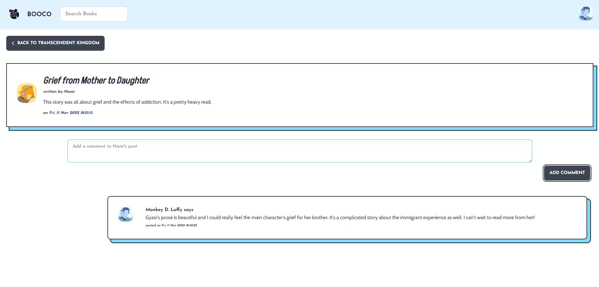

Registered readers can explore the community by seeing and writing their own posts on books they come across. They can also comment on other people's posts to further share their thoughts and even carrying out full discussions on different users' thoughts and help each other dissect other other's interpretations on the contents of the books.

You can access the above Posts page either by clicking on your own poston your home page or by checking your Friend's page and clicking on their posts.

Otherwise, you can go to a book's page and see the posts rendered below the details of the book, seen below:

    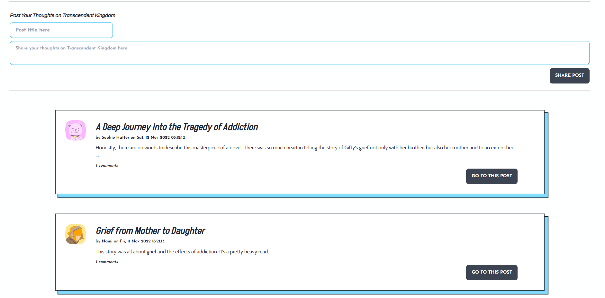

## Managing Friends

    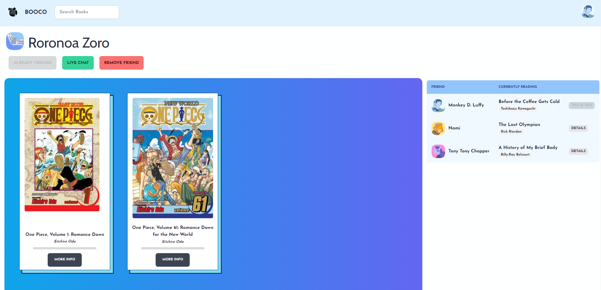

The above page is what you'd see of a user's page if you are friends. The below page is what you'll see if you and said user are <em>not</em> friends.

    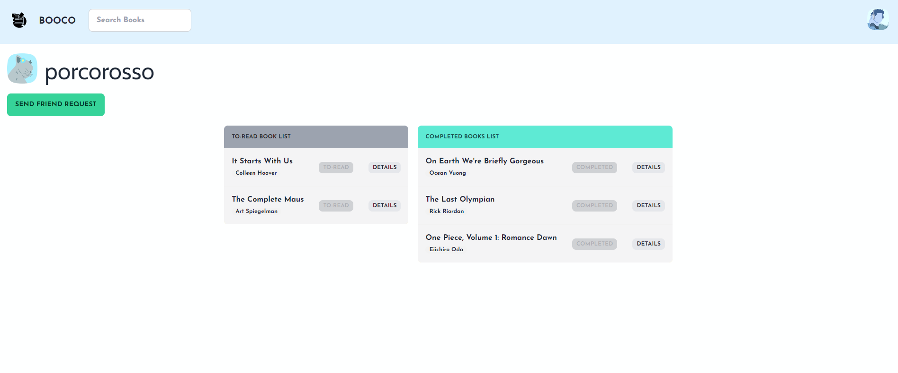

Once you're friends, you can see their friends, the books that they are currently reading, their progress in their books, as well as a list of their posts, to-read books, and completed books.

    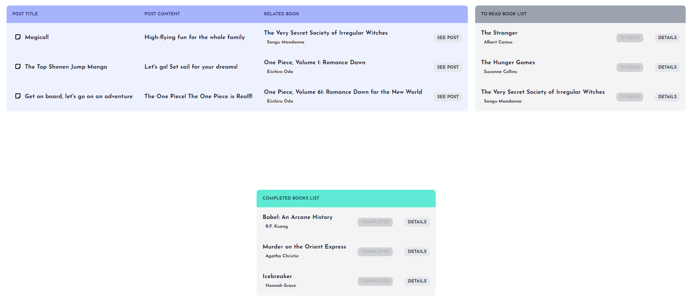

You can also see their favorite genre, favorite mood, and a total of their posts and comments:

    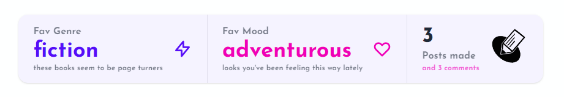

You can also remove a friend by clicking on the Remove button like so:

    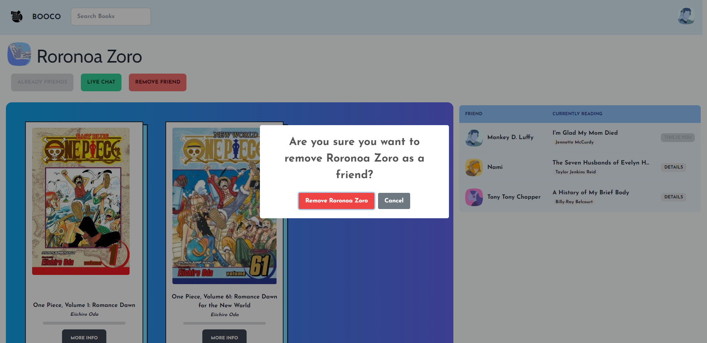

You can search for users as well and the results will be shown like so:

    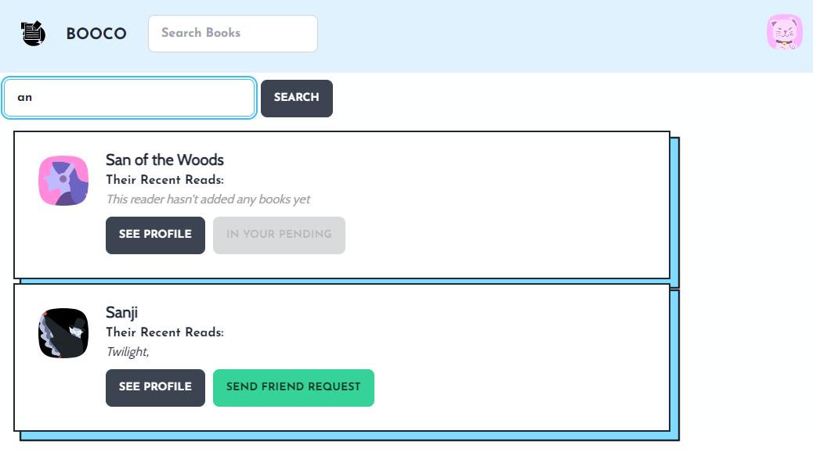

The button for sending a request will be disabled if the user is already friends with that other user in the search results.

You can search by email or username.

## One-to-One Live Chat Function

Once two users are friends, they can live chat each other.

    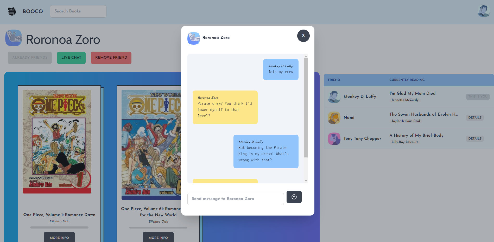

    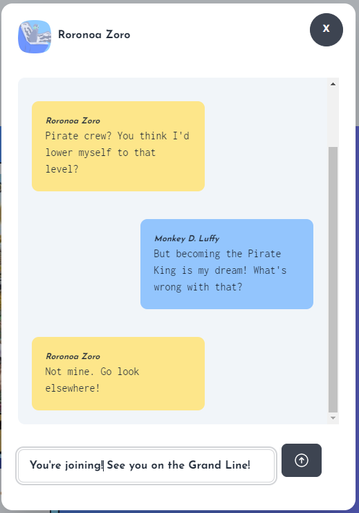

[<strong><em>Dev Notes:</em></strong> <em>The live chat feature is supported by ActionCable websockets on the backend and integrated with the React.js frontend with the '@rails/actioncable' npm package.

Furthermore all chat connections are secured through the use of a sending a token authentication over to the backend everytime a connection is made. This must be verified every time a new chat connection is made so that no unauthorized chats can be made by someone who is not registered or not friends. 

Every time a user enters or exits a chat, a new chat connection is made, disconnencted, and a new one is made again when they open up the chat again. Every connection attempt in the previous sentence will be verified by token authentication before the connection is established.</em>]

## Final Overview

    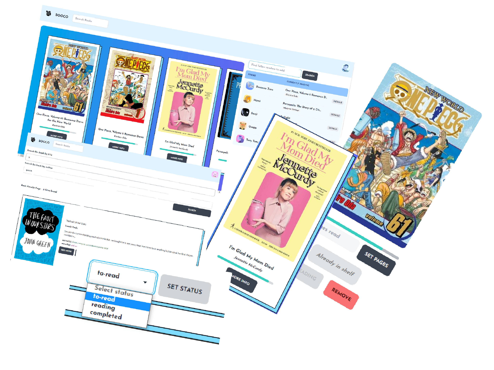

Continue exploring with us! Join the BOOCO community today and get reading. We've got a bunch of readers with us already who are expecting you.

Let's get reading today!

BOOCO is here to help.